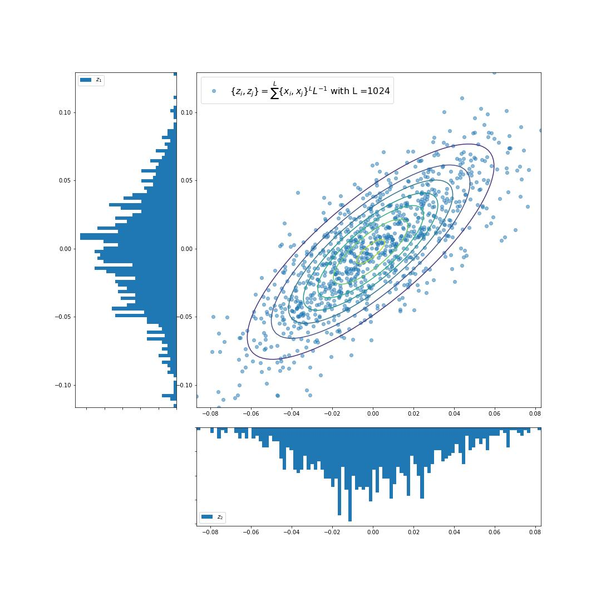
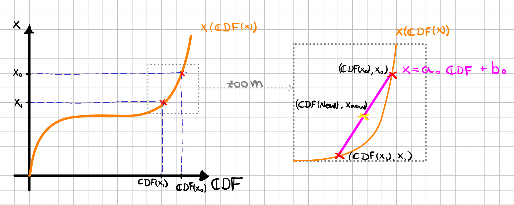

# A Course in Statistics and Data Analysis
> An introductory course in statistics and data analysis. 
> From theory to practical applications.

 

## Table of Contents
* [General Info](#general-information)
* [Technologies Used](#technologies-used)
* [Features](#features)
* [Screenshots](#screenshots)
* [Setup](#setup)
* [Acknowledgements](#acknowledgements)

## General Information

This is an introductory course in statistics and data analysis. All you need to follow this course is calculus, linear algebra, and some knowledge of Python. 

The `Practical Data Analysis.ipynb` notebook contains a compendium of information on statistics. From basic definitions to complex theorems. This main notebook is divided into lessons. If needed, another notebook or document will be listed for further studies (`Sampler.ipynb` and `usefull_proofs.xopp` for instance). 

Furthermore, there are some practice exercises for each lesson. The solutions for these exercises are presented in the `Assigment.ipynb`.

## Technologies Used
- Python 3.10
- Jupyter Notebooks

## Features
This repository currently has:
- Statistics studies notebook;
- Exercises with solutions;
- Module with basic functions created from scratch;
- Inverse Transform Sampler.

## Screenshots

## Setup
Modules required for this course are listed in the `requirements.txt` file. To set up your machine, execute the following in the command line:

`pip install -r requirements.txt`

## Acknowledgements

This is based on the course created by [Prof. Sandro Vitenti](https://github.com/vitenti). This is simply a guideline of studies.

## Contact
Created by [Lucas Corbanez](https://www.linkedin.com/in/lucas-corbanez/?locale=en_US) - feel free to contact me!
